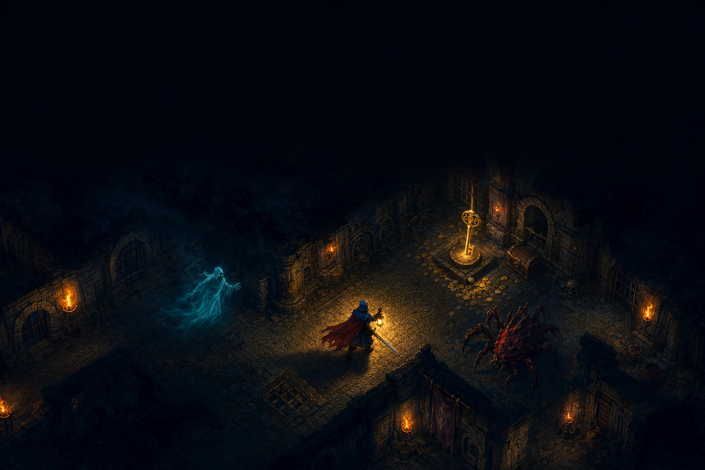
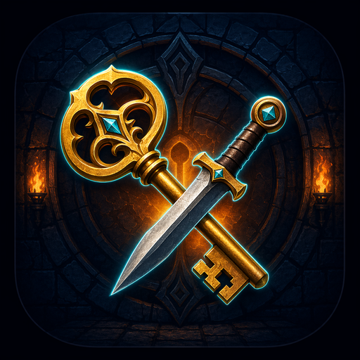
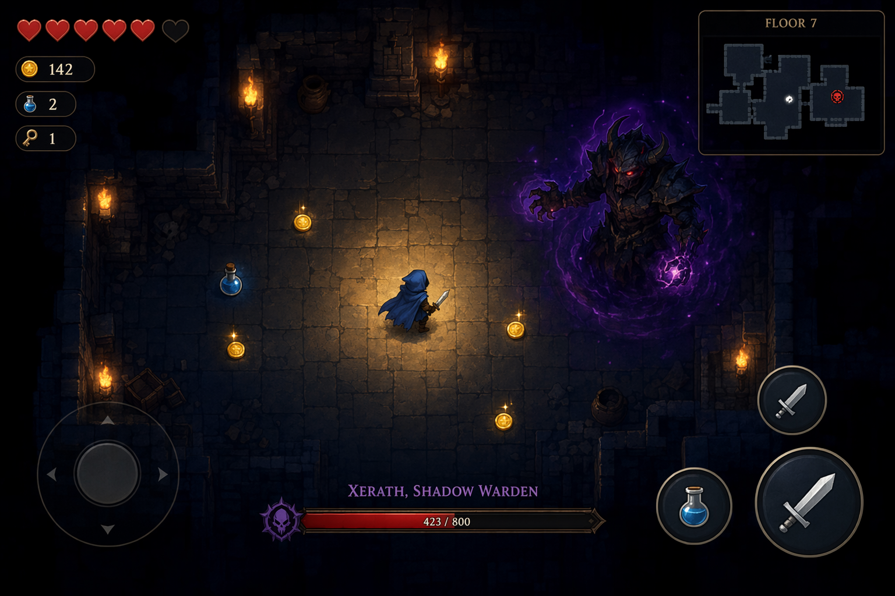

<div align="center">



# 🗝️ Shadow Vaults

### A torch-lit roguelite dungeon adventure that runs in any browser — and on Android.



Sword & thrown daggers · a boss fight · a between-floors shop · a fog-of-war minimap ·
synth music & SFX · and **automatically saved progress**.

*Built as a single, dependency-free HTML5 canvas game.*

</div>

## 📸 Screenshots

<div align="center">



<sub>⚠️ The images above are <b>placeholders</b> — replace <code>docs/banner.png</code> and
<code>docs/gameplay.png</code> with real captures (see <a href="docs/SCREENSHOTS.md">docs/SCREENSHOTS.md</a>).</sub>

</div>

---

## 🎮 Play it now

Because the whole game is one self-contained `index.html`, there's nothing to install:

- **Locally** — just open `index.html` in any modern browser (works fully offline).
- **Online** — host it anywhere static (see [Deploy](#-deploy) below) and share the link.
- **On your phone** — install it as an app (see [Android / PWA](#-android--mobile)).

## 📖 The quest

Three cursed floors lie beneath a ruined keep.

1. **Floors 1 & 2** — explore the dark, gather gold, and find the glowing **golden key**, then reach the **vault gate** to descend. A merchant appears between floors so you can spend your gold.
2. **Floor 3** — no gate. The **Vault Warden** blocks your escape. Defeat it to break the curse and win.

## 🕹️ Controls

| Action | Keyboard / Mouse | Touch |
|---|---|---|
| Move | `W A S D` or arrow keys | Left on-screen stick |
| Sword (arc melee) | `J` or `Space` | ⚔️ button |
| Throw dagger | `K`, or **click** toward target | 🗡️ button |
| Drink potion | `E` | 🧪 button |
| Sprint | `Shift` | (push stick fully) |
| Pause | `Esc` | — |
| Mute / unmute | `M` or the 🔊 button | 🔊 button |

> Sound starts on your first click/tap (a browser requirement).

## ✨ Features

- **Procedural dungeons** — every floor is freshly carved; no two runs alike.
- **Real combat** — sweeping sword arc + thrown daggers; enemies have health and drop gold.
- **Two enemy types** — wall-bound red *crawlers* and cyan *ghosts* that phase through stone.
- **Boss fight** — the Vault Warden charges and summons minions, with its own health bar.
- **Shop** — spend gold on max life, potions, swift boots, a brighter lantern, and weapon upgrades.
- **Minimap + compass** — fog-of-war map and an arrow pointing at your current objective.
- **Dynamic lighting** — torch glow and a lantern of darkness around you.
- **Audio** — an ambient synth drone plus procedural sound effects (no audio files).
- **Saved progress** — see below.

## 💾 Saved progress

Progress is stored in your browser's `localStorage` — no account, no server.

- **Continue** — your current run (floor, gold, life, potions, and all shop upgrades) is checkpointed at the start of each floor and after every purchase. Close the tab and a **CONTINUE** button appears on the title screen next time.
- **Run history & records** — the title screen tracks your **best gold**, **deepest floor**, total **runs**, **wins**, and your last few results (🏆 win / 💀 death).
- A run's checkpoint is cleared when you win or die; your records persist.

Storage keys: `shadowVaults.run.v1` (current run) and `shadowVaults.stats.v1` (records/history).
In the wrapped Android app, the same `localStorage` persists between launches.

## 🚀 Deploy

Rename nothing — the entry point is already `index.html`.

| Host | How |
|---|---|
| **Netlify Drop** | Drag this folder onto <https://app.netlify.com/drop> → instant URL |
| **GitHub Pages** | **Automatic** — a GitHub Actions workflow ([`.github/workflows/deploy.yml`](.github/workflows/deploy.yml)) publishes the game on every push to `main`. Just enable Settings → Pages → **Source: GitHub Actions** once. |
| **Cloudflare Pages / Vercel** | Connect the repo or drag-and-drop |
| **itch.io** | Upload as an HTML game, mark "play in browser" |

## 📱 Android / Mobile

Two paths, easiest first:

### A) Install as a PWA (no build tools)
Host the folder over HTTPS (any option above), open it in **Chrome on Android**, then
menu → **Install app** / **Add to Home screen**. It launches fullscreen, runs offline, and
saves progress like a native app.

### B) Build a real APK with Capacitor
A ready-to-go Capacitor setup lives in [`android/`](android/). See
[`android/README-ANDROID.md`](android/README-ANDROID.md) for the full steps — in short:

```bash
cd android
npm install
npm run sync            # copies the game into www/
npx cap add android
npx cap open android    # opens Android Studio → Build APK / Run
```

## 🗂️ Project structure

```
shadow-vaults/
├── index.html            # the entire game (canvas + logic + audio)
├── manifest.json         # PWA metadata
├── sw.js                 # service worker (offline + installable)
├── icon-192.png          # app icons
├── icon-512.png
├── README.md
├── LICENSE               # MIT
├── CHANGELOG.md
├── .gitignore
├── .github/
│   └── workflows/
│       └── deploy.yml    # auto-deploy to GitHub Pages on every push
├── docs/
│   ├── banner.png        # README header (placeholder)
│   ├── gameplay.png      # screenshot (placeholder)
│   └── SCREENSHOTS.md
└── android/              # Capacitor wrapper for a native APK
    ├── README-ANDROID.md
    ├── package.json
    ├── capacitor.config.json
    ├── assets/icon.png   # 1024px master for icon generation
    └── www/              # web assets copied here for the build
```

## 🛠️ Tech

Vanilla JavaScript, HTML5 `<canvas>`, the Web Audio API, and `localStorage`.
No frameworks, no build step, no dependencies for the web game.

## 📜 License

[MIT](LICENSE) — free to play, modify, and share.

<div align="center"><sub>Descend carefully. The vaults do not give up their treasure willingly.</sub></div>
